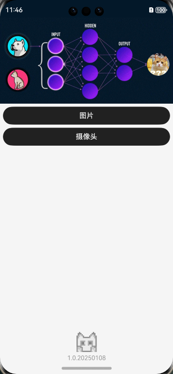
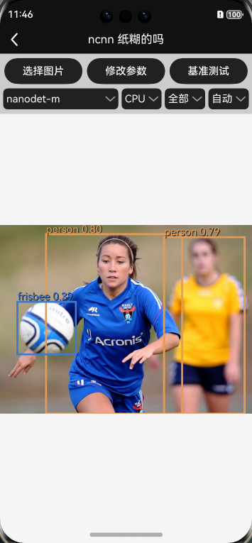
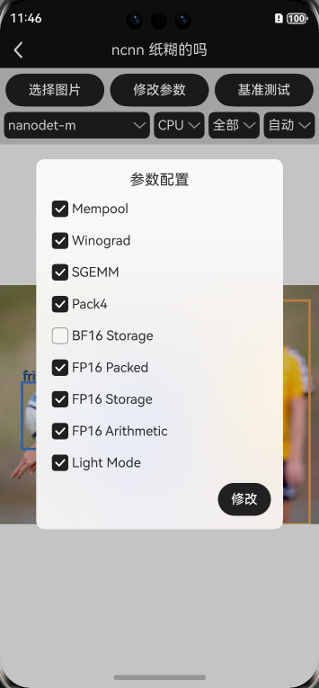
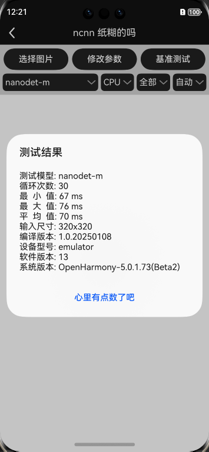
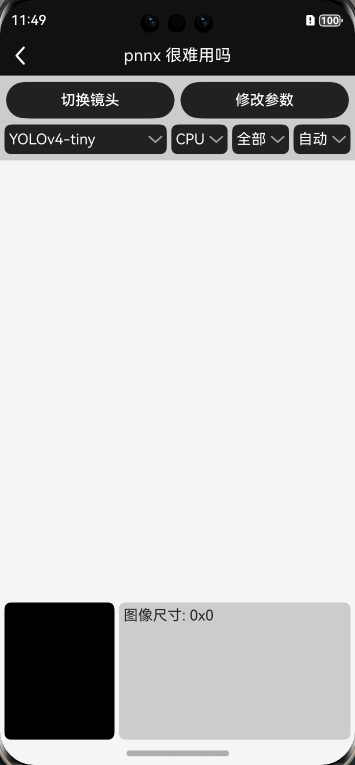

## :rocket: 如果有帮助，点个star！:star: ##

### 鸿蒙 OS ncnn 部署，项目示例 YOLOv4-tiny、nanodet-m 模型。

## Harmony OS:
- DevEco Studio 5.0.0
- NEXT API12

```code
从界面中选择需要测试的模型。
```
### 模型
| model | Harmony OS | from |                                                               other                                                               |
|-------------------|:--------:|:--------:|:---------------------------------------------------------------------------------------------------------------------------------:|
| YOLOv4-tiny       | yes |  [Github](https://github.com/ultralytics/yolov3)   | [ncnn](https://github.com/cmdbug/YOLOv5_NCNN) |
| NanoDet           | yes |  [Github](https://github.com/RangiLyu/nanodet)   | [ncnn](https://github.com/cmdbug/YOLOv5_NCNN) [TNN](https://github.com/cmdbug/TNN_Demo) [MNN](https://github.com/cmdbug/MNN_Demo) |


### Harmony OS:
- 模拟器运行的是非 vulkan 版本
- 真机运行需要自己配置下签名证书(可以自动生成)
- 示例可能存在bug，555

该项目是练习各种模型的使用与部署，在速度上没有过多处理。如果对速度有要求需要自行处理。项目模型放在 tncnn 模块下，使用时把 rawfile 里面的模型复制到沙盒中，再使用沙盒的路径完成模型加载，直接加载 rawfile 中的模型比较麻烦，有需要的自行处理。

懒人本地转换(不会上传模型): [xxxx -> ncnn](https://convertmodel.com/)

轻量级OpenCV:[opencv-mobile](https://github.com/nihui/opencv-mobile)

:art: 截图<br/>

> Harmony OS

| 主页                                                           | 示例                                                                | 配置                                                             |
|--------------------------------------------------------------|-------------------------------------------------------------------|----------------------------------------------------------------|
|  |  |  |

| 基准测试 (模拟器结果仅供参考)                                                  | 相机                                                             |
|-------------------------------------------------------------------|----------------------------------------------------------------|
|  |  |


感谢:<br/>
- nihui, RangiLyu
- https://github.com/Tencent/ncnn

